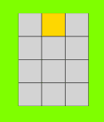
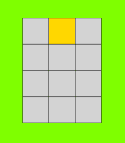
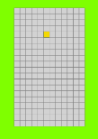
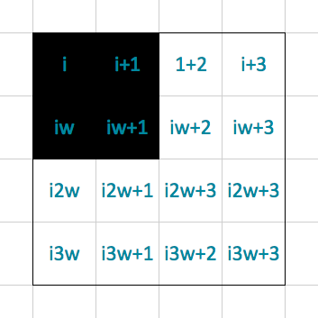
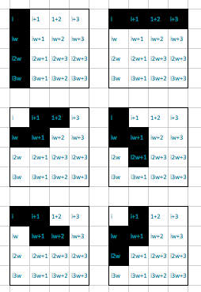
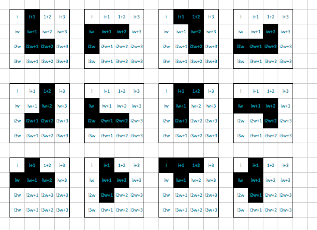

# Stack My Bits Up
###GA WDI London - Project 1 
#### It's almost Tetris!

This Tetris variation was created using HTML, CSS, JavaScript/JQuery for Web Development Immersive course at General Assembly London. 

####There are only two rules: 

* Clear lines by filling the whole row
* Don't let it stack up to the top!

[Play it here.](https://stackmybitsup.herokuapp.com)

##Controls
* Left / Right Arrows = move piece left / right
* Down Arrow = move piece one row down
* W = turn clockwise
* Q = turn counter-clockwise

####Approach / How it works

Started off by building a 3x4 board, with one lit up square moving down and staying at the bottom row.

Next was making the piece occupy the last row available.

Next step, ability to move left / right / down with arrow keys. Then, increase grids.

Current version has 20 rows and 12 columns, so a total of 240 gridblocks. The row and column numbers can be changed in the JavaScript file and the gameboard will work for any combination (I think).

Possible shapes are defined in the JavaScript as well.

Each moving piece is defined by a div (of the whole grid) with a class, which gets moved down one row every .2 seconds. The user uses the left and right arrows to increase/decrease the index by one depending on the direction. 

####The build

* HTML 5, CSS and jQuery were used to create this game. 
* The Google Web Font 'Press Start2P' and 'Quicksand' have been used to style the game.

#### Problems & Challenges
* Shape rotations
* Border control (on move and rotate)
* Dropping rows after clearing one/many

